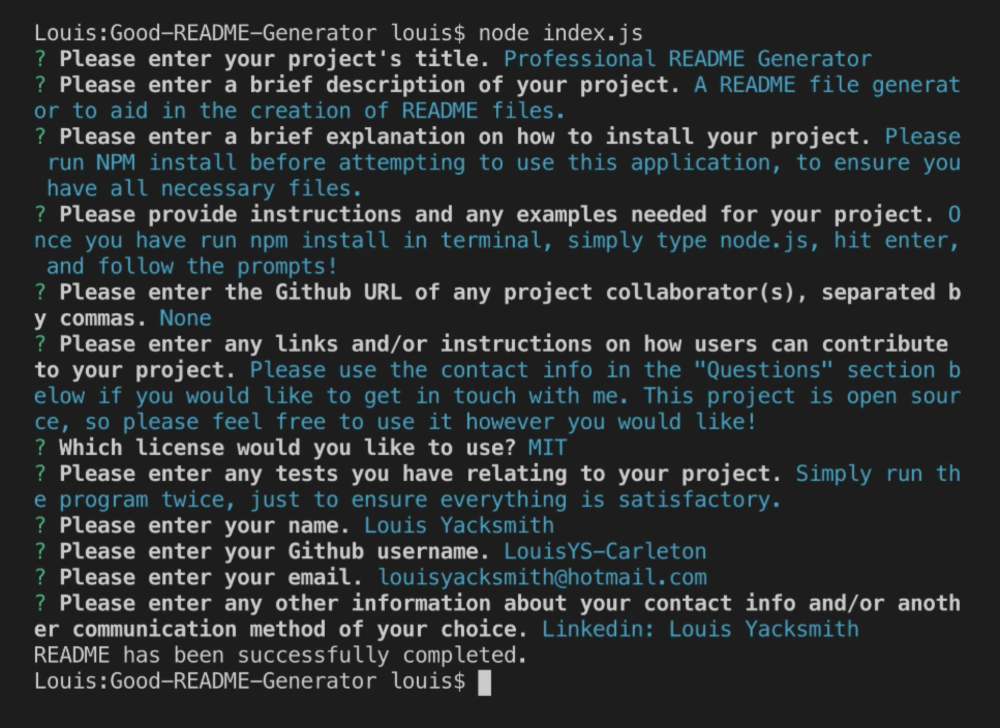
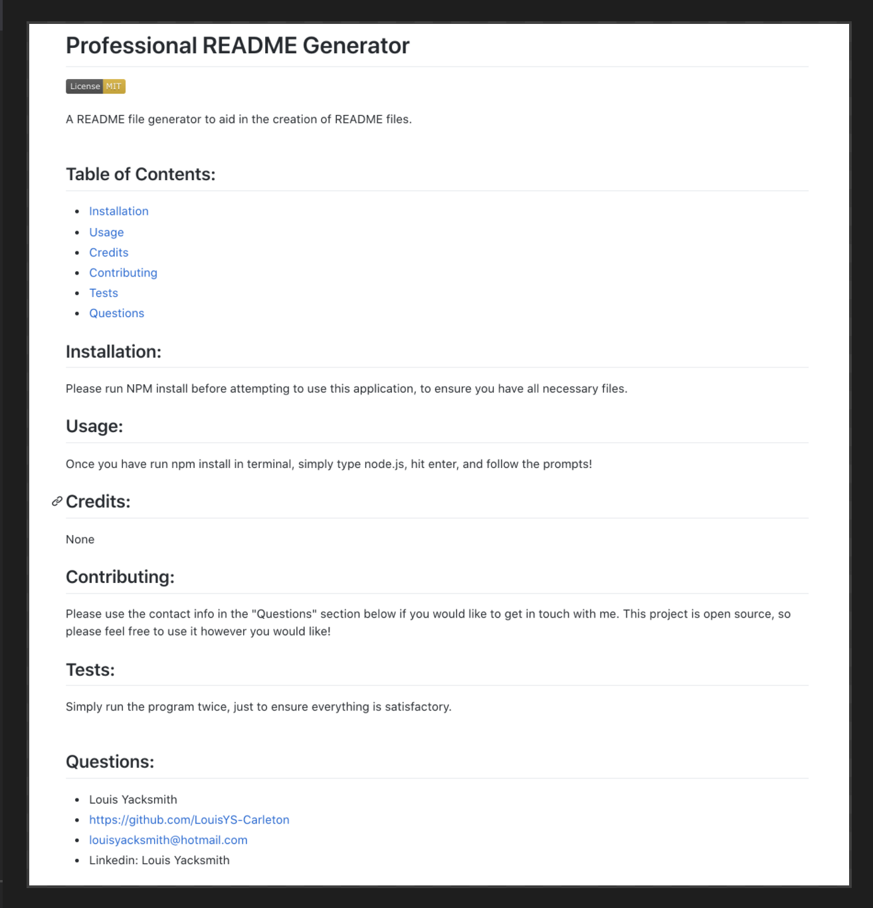

# Professional README Generator
A README.md file generator, designed to help developers speed up the often repetitive task of writing professional README files.

## Video Link
https://youtu.be/L2Zw7D0bZsY

## Table of Contents:
* [Installation](#installation)
* [Usage](#usage)
* [Credits](#credits)
* [Contributing](#contributing)
* [Tests](#tests)
* [Questions](#questions) 

## Installation:
It's important to run "npm install" in your terminal before launching this application to ensure you have all the necessary files.

## Usage:
Once you have run npm install in your terminal, simply type "node.js", hit enter, and then follow the prompts. Make sure you do not have any existing README files in the target directory, as they will be overwritten.

## Credits:
None

## Contributing:
This project is open source, so please feel free to use it in any way you see fit! If you have any questions please feel free to get in touch with me through one of the links in the "Questions" section below.

## Tests:
Test README generator once before creating final copy, just to ensure everything is to your liking.

## Questions:
* Louis Yacksmith
* https://github.com/LouisYS-Carleton
* louisyacksmith@hotmail.com
* https://www.linkedin.com/in/louis-yacksmith-2a06321b2/